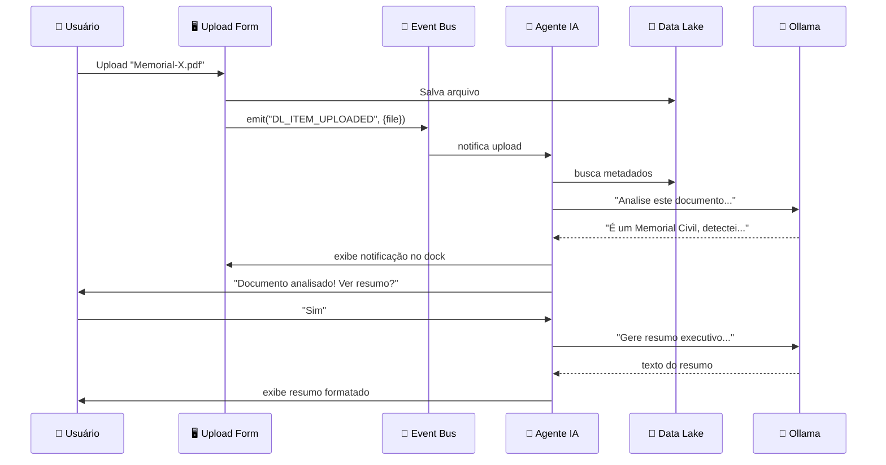

# 🤖 Demonstração: Agente Conversacional Interno

## 📱 Interface Visual (Dock Flutuante)

### Estado Minimizado
```
┌─────────────────────────────────────┐
│                                     │
│         [Seu App Mine-Docs]         │
│                                     │
│                                     │
│                                     │
│                            ╔═══╗   │
│                            ║ 🤖║   │ ← Botão flutuante
│                            ╚═══╝   │
└─────────────────────────────────────┘
```

### Estado Expandido (Chat Ativo)
```
┌─────────────────────────────────────┐
│  [Seu App Mine-Docs]                │
│                                     │
│  ┌──────────────────────────────┐  │
│  │ 🤖 Assistente IA    [_][□][✕]│  │
│  ├──────────────────────────────┤  │
│  │ 💬 Chat   ⚙️ Config   📊 Modo│  │
│  ├──────────────────────────────┤  │
│  │                              │  │
│  │ 🤖 Olá! Detectei 3 novos    │  │
│  │    documentos no Data Lake.  │  │
│  │    Quer que eu analise?      │  │
│  │                              │  │
│  │ 👤 Sim, me mostre um resumo │  │
│  │                              │  │
│  │ 🤖 Analisando...             │  │
│  │    ✓ Memorial-2024.pdf       │  │
│  │    ✓ Especificação-X.docx    │  │
│  │    ✓ Folha-Dados-Britador.pdf│  │
│  │                              │  │
│  │    Principais descobertas:   │  │
│  │    • 2 docs sobre britagem   │  │
│  │    • 1 memorial civil        │  │
│  │    • Normas: ABNT NBR...     │  │
│  │                              │  │
│  ├──────────────────────────────┤  │
│  │ Digite sua mensagem...    [▶]│  │
│  └──────────────────────────────┘  │
└─────────────────────────────────────┘
```

---

## 🎬 Cenários de Uso (Exemplos Práticos)

### Cenário 1: Upload Proativo
```
┌─ TIMELINE ────────────────────────────────────┐
│                                               │
│  👤 Usuário faz upload de "Projeto-X.pdf"    │
│      ↓                                        │
│  📤 Sistema: DL_ITEM_UPLOADED event           │
│      ↓                                        │
│  🤖 Agente detecta e reage:                   │
│     "Recebi o arquivo Projeto-X.pdf           │
│      Detectei que é um Memorial Descritivo    │
│      Posso indexar automaticamente?"          │
│      ↓                                        │
│  👤 "Sim"                                     │
│      ↓                                        │
│  🤖 "✓ Indexado                               │
│      ✓ 12 termos técnicos extraídos           │
│      ✓ Vinculado a 3 docs similares           │
│      📊 Ver relatório completo?"              │
│                                               │
└───────────────────────────────────────────────┘
```

### Cenário 2: Consulta RAG
```
┌─ CONVERSA ────────────────────────────────────┐
│                                               │
│  👤 "Quais equipamentos temos para britagem   │
│      com capacidade acima de 500 t/h?"       │
│                                               │
│  🤖 "Consultando Data Lake... 🔍              │
│                                               │
│      Encontrei 3 equipamentos:                │
│                                               │
│      1. Britador Cônico HP-500                │
│         📄 Fonte: folha-dados-2023.pdf        │
│         • Capacidade: 650 t/h                 │
│         • Potência: 400 kW                    │
│         • Norma: ABNT NBR 13028               │
│                                               │
│      2. Britador de Mandíbula XR-800          │
│         📄 Fonte: especificacao-britagem.docx │
│         • Capacidade: 800 t/h                 │
│         • Potência: 560 kW                    │
│                                               │
│      3. Britador de Impacto GX-700            │
│         📄 Fonte: memorial-planta-2024.pdf    │
│         • Capacidade: 720 t/h                 │
│         • Potência: 480 kW                    │
│                                               │
│      🔗 Ver documentos completos?             │
│      📊 Gerar comparativo técnico?            │
│                                               │
└───────────────────────────────────────────────┘
```

### Cenário 3: Modo Autopilot
```
┌─ MODO AUTOPILOT ATIVO ────────────────────────┐
│                                               │
│  🤖 [11:23] Detectei 5 novos docs hoje       │
│             Processando automaticamente...     │
│                                               │
│  🤖 [11:25] ✓ Indexação completa              │
│             📊 Relatório:                     │
│             • 3 Folhas de dados               │
│             • 1 Memorial                      │
│             • 1 Especificação                 │
│             • 47 termos técnicos extraídos    │
│             • 12 conexões com docs existentes │
│                                               │
│  🤖 [11:30] ⚠️ Duplicata detectada!           │
│             "Especificação-Bomba-X.pdf"       │
│             já existe como                    │
│             "Bomba-X-Rev2.pdf" (98% similar)  │
│             Ação sugerida: Mesclar versões    │
│                                               │
│  🤖 [14:15] 💡 Insight automático:            │
│             Todos os equipamentos da série    │
│             "XR" usam norma ABNT NBR 13028.   │
│             Sugestão: criar tag "XR-Series"?  │
│                                               │
└───────────────────────────────────────────────┘
```

---

## ⚙️ Painel de Configuração

```
┌─ CONFIGURAÇÕES ───────────────────────────────┐
│                                               │
│  🔌 PROVEDOR DE IA                            │
│  ○ Ollama (Local) - Recomendado ✓            │
│     └─ 🔗 http://localhost:11434              │
│     └─ 📦 Modelo: qwen2.5:14b-instruct        │
│                                               │
│  ○ OpenAI-Compatible (Nuvem)                  │
│     └─ 🔗 Base URL: _________________         │
│     └─ 🔑 API Key:  [••••••••••••]            │
│     └─ 📦 Modelo: ___________________         │
│                                               │
│  ────────────────────────────────────────────│
│                                               │
│  🎭 MODO DE OPERAÇÃO                          │
│  ☑ Reativo (responde quando chamado)          │
│  ☐ Proativo (monitora eventos)                │
│  ☐ Autopilot (age automaticamente)            │
│                                               │
│  ────────────────────────────────────────────│
│                                               │
│  🎛️ PARÂMETROS                                │
│  Temperature:    [━━━━━━━━━○] 0.7            │
│  Max Tokens:     [━━━━━━━○━━] 2048           │
│  Context Window: [━━━━━━━━━○] 8192           │
│                                               │
│  ────────────────────────────────────────────│
│                                               │
│  🔐 SEGURANÇA                                 │
│  ☑ Logs locais apenas                         │
│  ☑ Não enviar dados sensíveis                 │
│  ☐ Modo debug (verbose logs)                  │
│                                               │
│  [Salvar]  [Testar Conexão]  [Restaurar]     │
│                                               │
└───────────────────────────────────────────────┘
```

---

## 🔄 Fluxo de Eventos (Diagrama)



---

## 🎨 Estados Visuais

### Loading / Processando
```
┌─────────────────────┐
│  🤖 Assistente IA   │
├─────────────────────┤
│                     │
│  🔄 Analisando...   │
│  ████████░░░░ 67%   │
│                     │
│  ⏱️ ~5 segundos     │
│                     │
└─────────────────────┘
```

### Erro / Offline
```
┌─────────────────────┐
│  🤖 Assistente IA   │
├─────────────────────┤
│                     │
│  ⚠️ Ollama offline  │
│                     │
│  Não consegui       │
│  conectar ao        │
│  servidor local.    │
│                     │
│  [Reconectar]       │
│  [Ver Logs]         │
│                     │
└─────────────────────┘
```

### Modo Compacto (Mini)
```
┌──────┐
│  🤖  │  ← Ícone sempre visível
│  💬3 │  ← Badge com msgs não lidas
└──────┘
```

---

## 📊 Comparação: Antes vs Depois

### ❌ ANTES (Sem Agente)
```
1. Usuário faz upload
2. Sistema apenas armazena
3. Usuário precisa lembrar de:
   - Adicionar tags manualmente
   - Preencher metadados
   - Verificar duplicatas
   - Vincular docs relacionados
4. Conhecimento fica disperso
5. Busca é apenas por texto exato
```

### ✅ DEPOIS (Com Agente)
```
1. Usuário faz upload
2. Agente detecta e reage:
   ✓ Sugere tags automaticamente
   ✓ Extrai metadados do conteúdo
   ✓ Alerta sobre duplicatas
   ✓ Vincula docs similares
   ✓ Indexa termos técnicos
3. Usuário apenas confirma ou ajusta
4. Conhecimento fica estruturado
5. Busca semântica (RAG) disponível
6. Respostas com citações das fontes
```

---

## 💬 Exemplos de Prompts do Usuário

### Consultas Técnicas
```
"Quais normas ABNT são citadas nos documentos de britagem?"
"Me mostre todos os equipamentos com potência acima de 300kW"
"Qual é a capacidade total instalada de processamento?"
```

### Análise e Relatórios
```
"Gere um comparativo entre os britadores HP-500 e XR-800"
"Resuma os memoriais descritivos de 2024"
"Liste todos os fabricantes mencionados nos documentos"
```

### Operações Automatizadas
```
"Indexe todos os documentos novos da última semana"
"Verifique se há duplicatas no Data Lake"
"Extraia tabelas técnicas de todos os PDFs"
```

### Proatividade (Modo Autopilot)
```
🤖 "Detectei que você fez 5 uploads hoje. Quer que eu gere 
    um relatório consolidado?"

🤖 "Notei que 3 documentos mencionam a norma NBR-13028 mas 
    não estão tagueados. Posso corrigir?"

🤖 "Novos documentos têm termos técnicos não cadastrados.
    Sugestões: 'Taxa de Redução', 'Abertura CSS', 'GPM'..."
```

---

## 🚀 Benefícios Visualizados

### Para o Engenheiro
```
┌─ TEMPO ECONOMIZADO ──────────────────────────┐
│                                              │
│  Tarefa Manual → Com Agente                  │
│                                              │
│  Indexar doc:     15 min → 30 seg ⚡         │
│  Buscar info:     10 min → 20 seg ⚡         │
│  Gerar relatório: 45 min → 2 min ⚡          │
│  Encontrar norma: 20 min → 10 seg ⚡         │
│                                              │
│  💰 Economia média: ~2h/dia por engenheiro   │
│                                              │
└──────────────────────────────────────────────┘
```

### Para a Empresa
```
┌─ IMPACTO ORGANIZACIONAL ─────────────────────┐
│                                              │
│  ✓ Padronização de processos                 │
│  ✓ Conhecimento sempre acessível             │
│  ✓ Redução de retrabalho                     │
│  ✓ Onboarding mais rápido (novo funcionário) │
│  ✓ Auditoria facilitada (rastreabilidade)    │
│  ✓ Decisões baseadas em dados reais          │
│                                              │
└──────────────────────────────────────────────┘
```

---

## 🔒 Segurança e Privacidade

```
┌─ GARANTIAS ──────────────────────────────────┐
│                                              │
│  🏢 DADOS LOCAIS (Ollama):                   │
│     ✓ Nada sai da empresa                    │
│     ✓ Sem chamadas externas                  │
│     ✓ GPU corporativa dedicada               │
│     ✓ Logs apenas internos                   │
│                                              │
│  🔐 DADOS SENSÍVEIS:                         │
│     ✓ RLS no Supabase (por usuário)          │
│     ✓ Embeddings armazenados localmente      │
│     ✓ Sem telemetria para terceiros          │
│                                              │
│  📋 AUDITORIA:                               │
│     ✓ Log de todas as interações             │
│     ✓ Histórico de conversas                 │
│     ✓ Rastreabilidade de decisões            │
│                                              │
└──────────────────────────────────────────────┘
```

---

## 📈 Roadmap de Recursos

```
FASE 0: MVP (2-4 horas)
├─ ✓ Dock flutuante básico
├─ ✓ Chat com Ollama
├─ ✓ Event bus mínimo
└─ ✓ Config manual de provider

FASE 1: RAG (1 semana)
├─ ✓ Embeddings locais (bge-m3)
├─ ✓ pgvector no Supabase
├─ ✓ Busca semântica
└─ ✓ Respostas com citações

FASE 2: Inteligência (2 semanas)
├─ ✓ Modo proativo
├─ ✓ Detecção de duplicatas
├─ ✓ Sugestões automáticas
└─ ✓ Roteamento local↔nuvem

FASE 3: Autopilot (1 mês)
├─ ✓ Indexação automática
├─ ✓ Relatórios agendados
├─ ✓ Alertas inteligentes
└─ ✓ Políticas de governança
```

---

## 🎯 Conclusão

Este agente transforma o **mine-docs-ai** de um **sistema passivo de armazenamento** em um **assistente inteligente ativo** que:

- 🧠 **Entende** o contexto dos documentos
- 💬 **Conversa** em linguagem natural
- 🔍 **Busca** com inteligência semântica
- 📊 **Analisa** e gera insights
- ⚡ **Age** proativamente
- 🔒 **Mantém** tudo local e seguro

**Próximo passo**: Implementar a Fase 0 (MVP) para validar o conceito com usuários reais.

---

_Demonstração gerada para o projeto mine-docs-ai_
_Criado em: 2025-01-29_
